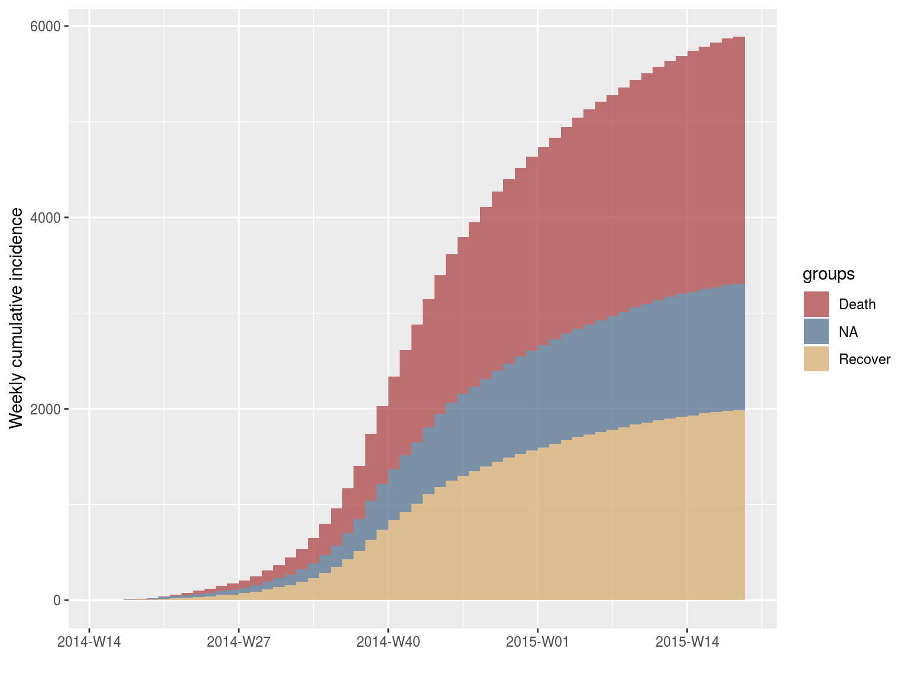
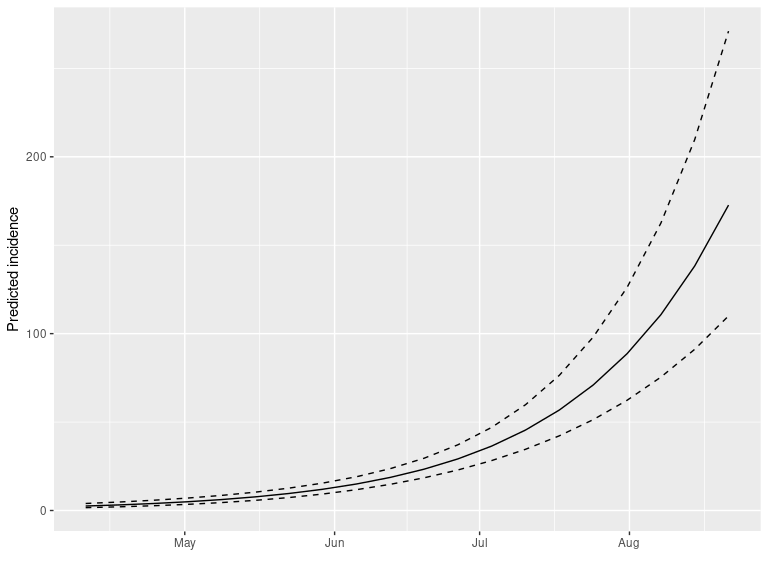
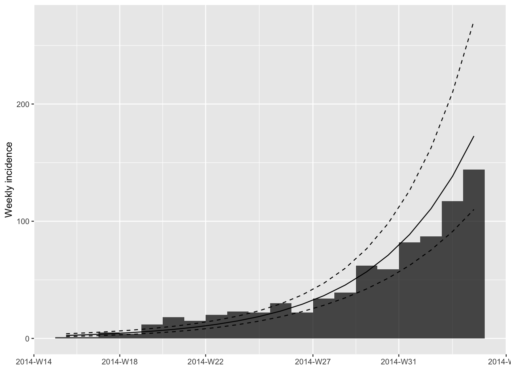

<br>

[](https://travis-ci.org/reconhub/incidence)
[](https://ci.appveyor.com/project/thibautjombart/incidence/branch/master)
[](https://codecov.io/github/reconhub/incidence?branch=master)
[](https://cran.r-project.org/package=incidence)
[](https://cran.r-project.org/package=incidence)
[](http://www.r-pkg.org/pkg/incidence)

[](https://zenodo.org/badge/latestdoi/49890366)

# Installing the package

To install the current stable, CRAN version of the package, type:

``` r
install.packages("incidence")
```

To benefit from the latest features and bug fixes, install the
development, *github* version of the package using:

``` r
devtools::install_github("reconhub/incidence")
```

Note that this requires the package *devtools* installed.

# What does it do?

The main features of the package include:

  - **`incidence`**: compute incidence from dates in various formats;
    any fixed time interval can be used; the returned object is an
    instance of the (S3) class *incidence*.

  - **`plot`**: this method (see `?plot.incidence` for details) plots
    *incidence* objects, and can also add predictions of the model(s)
    contained in an *incidence\_fit* object (or a list of such objects).

  - **`fit`**: fit one or two exponential models (i.e. linear regression
    on log-incidence) to an *incidence* object; two models are
    calibrated only if a date is provided to split the time series in
    two (argument `split`); this is typically useful to model the two
    phases of exponential growth, and decrease of an outbreak; each
    model returned is an instance of the (S3) class *incidence\_fit*,
    each of which contains various useful information (e.g. growth rate
    *r*, doubling/halving time, predictions and confidence intervals);
    results can be plotted using `plot`, or added to an existing
    `uncudence` plot using the piping-friendly function
    `add_incidence_fit`.

  - **`fit_optim_split`**: finds the optimal date to split the time
    series in two, typically around the peak of the epidemic.

  - **`[`**: lower-level subsetan of *incidence* objects, permiting to
    specify which dates and groups to retain; uses a syntax similar to
    matrices, i.e. `x[i, j]`, where `x` is the *incidence* object, `i` a
    subset of dates, and `j` a subset of groups.

  - **`subset`**: subset an *incidence* object by specifying a time
    window.

  - **`pool`**: pool incidence from different groups into one global
    incidence time series.

  - **`cumulate`**: computes cumulative incidence over time from and
    `incidence` object.

  - **`as.data.frame`**: converts an *incidence* object into a
    `data.frame` containing dates and incidence values.

  - **`bootstrap`**: generates a bootstrapped *incidence* object by
    re-sampling, with replacement, the original dates of events.

  - **`find_peak`**: locates the peak time of the epicurve.

  - **`estimate_peak`**: uses bootstrap to estimate the peak time (and
    related confidence interval) of a partially observed outbreak.

# Resources

## Vignettes

An overview of *incidence* is provided below in the worked example
below. More detailed tutorials are distributed as vignettes with the
package:

``` r
vignette("overview", package="incidence")
vignette("customize_plot", package="incidence")
vignette("incidence_class", package="incidence")
vignette("incidence_fit_class", package="incidence")
vignette("conversions", package="incidence")
```

## Websites

The following websites are available:

  - The official *incidence* website, providing an overview of the
    package’s functionalities, up-to-date tutorials and documentation:
    <br> <https://www.repidemicsconsortium.org/incidence>

  - The *incidence* project on *github*, useful for developers,
    contributors, and users wanting to post issues, bug reports and
    feature requests: <br> <https://github.com/reconhub/incidence>

  - The *incidence* page on CRAN: <br>
    <https://CRAN.R-project.org/package=incidence>

## Getting help online

Bug reports and feature requests should be posted on *github* using the
[*issue* system](https://github.com/reconhub/incidence/issues). All
other questions should be posted on the **RECON forum**: <br>
<https://www.repidemicsconsortium.org/forum/>

# A quick overview

The following worked example provides a brief overview of the package’s
functionalities. See the [*vignettes section*](#vignettes) for more
detailed tutorials.

## Loading the data

This example uses the simulated Ebola Virus Disease (EVD) outbreak from
the package [*outbreaks*](https://github.com/reconhub/outbreaks). We
will compute incidence for various time steps, calibrate two exponential
models around the peak of the epidemic, and analyse the results.

First, we load the data:

``` r
library(outbreaks)
library(ggplot2)
library(incidence)

dat <- ebola_sim$linelist$date_of_onset
class(dat)
#> [1] "Date"
head(dat)
#> [1] "2014-04-07" "2014-04-15" "2014-04-21" "2014-04-27" "2014-04-26"
#> [6] "2014-04-25"
```

## Computing and plotting incidence

We compute the weekly incidence:

``` r
i.7 <- incidence(dat, interval = 7)
i.7
#> <incidence object>
#> [5888 cases from days 2014-04-07 to 2015-04-27]
#> [5888 cases from ISO weeks 2014-W15 to 2015-W18]
#> 
#> $counts: matrix with 56 rows and 1 columns
#> $n: 5888 cases in total
#> $dates: 56 dates marking the left-side of bins
#> $interval: 7 days
#> $timespan: 386 days
#> $cumulative: FALSE
plot(i.7)
```

<!-- -->

`incidence` can also compute incidence by specified groups using the
`groups` argument. For instance, we can compute the weekly incidence by
gender:

``` r
i.7.sex <- incidence(dat, interval = "week", groups = ebola_sim$linelist$gender)
i.7.sex
#> <incidence object>
#> [5888 cases from days 2014-04-07 to 2015-04-27]
#> [5888 cases from ISO weeks 2014-W15 to 2015-W18]
#> [2 groups: f, m]
#> 
#> $counts: matrix with 56 rows and 2 columns
#> $n: 5888 cases in total
#> $dates: 56 dates marking the left-side of bins
#> $interval: 1 week
#> $timespan: 386 days
#> $cumulative: FALSE
plot(i.7.sex, stack = TRUE, border = "grey")
```

<!-- -->

## Handling `incidence` objects

`incidence` objects can be manipulated easily. The `[` operator
implements subetting of dates (first argument) and groups (second
argument). For instance, to keep only the first 20 weeks of the
epidemic:

``` r
i.7[1:20]
#> <incidence object>
#> [797 cases from days 2014-04-07 to 2014-08-18]
#> [797 cases from ISO weeks 2014-W15 to 2014-W34]
#> 
#> $counts: matrix with 20 rows and 1 columns
#> $n: 797 cases in total
#> $dates: 20 dates marking the left-side of bins
#> $interval: 7 days
#> $timespan: 134 days
#> $cumulative: FALSE
plot(i.7[1:20])
```

<!-- -->

Some temporal subsetting can be even simpler using `subset`, which
permits to retain data within a specified time window:

``` r
i.tail <- subset(i.7, from = as.Date("2015-01-01"))
i.tail
#> <incidence object>
#> [1156 cases from days 2015-01-05 to 2015-04-27]
#> [1156 cases from ISO weeks 2015-W02 to 2015-W18]
#> 
#> $counts: matrix with 17 rows and 1 columns
#> $n: 1156 cases in total
#> $dates: 17 dates marking the left-side of bins
#> $interval: 7 days
#> $timespan: 113 days
#> $cumulative: FALSE
plot(i.tail, border = "white")
```

<!-- -->

Subsetting groups can also matter. For instance, let’s try and visualise
the incidence based on onset of symptoms by
outcome:

``` r
i.7.outcome <- incidence(dat, "week", groups = ebola_sim$linelist$outcome)
i.7.outcome
#> <incidence object>
#> [5888 cases from days 2014-04-07 to 2015-04-27]
#> [5888 cases from ISO weeks 2014-W15 to 2015-W18]
#> [3 groups: Death, Recover, NA]
#> 
#> $counts: matrix with 56 rows and 3 columns
#> $n: 5888 cases in total
#> $dates: 56 dates marking the left-side of bins
#> $interval: 1 week
#> $timespan: 386 days
#> $cumulative: FALSE
plot(i.7.outcome, stack = TRUE, border = "grey")
```

<!-- -->

To visualise the cumulative incidence:

``` r
i.7.outcome.cum <- cumulate(i.7.outcome)
i.7.outcome.cum
#> <incidence object>
#> [5888 cases from days 2014-04-07 to 2015-04-27]
#> [5888 cases from ISO weeks 2014-W15 to 2015-W18]
#> [3 groups: Death, Recover, NA]
#> 
#> $counts: matrix with 56 rows and 3 columns
#> $n: 5888 cases in total
#> $dates: 56 dates marking the left-side of bins
#> $interval: 1 week
#> $timespan: 386 days
#> $cumulative: TRUE
plot(i.7.outcome.cum)
```

<!-- -->

Groups can also be collapsed into a single time series using `pool`:

``` r
i.pooled <- pool(i.7.outcome)
i.pooled
#> <incidence object>
#> [5888 cases from days 2014-04-07 to 2015-04-27]
#> [5888 cases from ISO weeks 2014-W15 to 2015-W18]
#> 
#> $counts: matrix with 56 rows and 1 columns
#> $n: 5888 cases in total
#> $dates: 56 dates marking the left-side of bins
#> $interval: 1 week
#> $timespan: 386 days
#> $cumulative: FALSE
identical(i.7$counts, i.pooled$counts)
#> [1] TRUE
```

## Modelling incidence

Incidence data, excluding zeros, can be modelled using log-linear
regression of the form: log(*y*) = *r* x *t* + *b*

where *y* is the incidence, *r* is the growth rate, *t* is the number of
days since a specific point in time (typically the start of the
outbreak), and *b* is the intercept.

Such model can be fitted to any incidence object using `fit`. Of course,
a single log-linear model is not sufficient for modelling our time
series, as there is clearly an growing and a decreasing phase. As a
start, we can calibrate a model on the first 20 weeks of the epidemic:

``` r
plot(i.7[1:20])
```

<!-- -->

``` r
early.fit <- fit(i.7[1:20])
early.fit
#> <incidence_fit object>
#> 
#> $model: regression of log-incidence over time
#> 
#> $info: list containing the following items:
#>   $r (daily growth rate):
#> [1] 0.03175771
#> 
#>   $r.conf (confidence interval):
#>           2.5 %     97.5 %
#> [1,] 0.02596229 0.03755314
#> 
#>   $doubling (doubling time in days):
#> [1] 21.8261
#> 
#>   $doubling.conf (confidence interval):
#>         2.5 %   97.5 %
#> [1,] 18.45777 26.69823
#> 
#>   $pred: data.frame of incidence predictions (20 rows, 5 columns)
```

The resulting objects can be plotted, in which case the prediction and
its confidence interval is displayed:

``` r
plot(early.fit)
```

<!-- -->

However, a better way to display these predictions is adding them to the
incidence plot using the argument `fit`:

``` r
plot(i.7[1:20], fit = early.fit)
```

<!-- -->

Alternatively, these can be piped using:

``` r
library(magrittr)
plot(i.7[1:20]) %>% add_incidence_fit(early.fit)
```

<!-- -->

In this case, we would ideally like to fit two models, before and after
the peak of the epidemic. This is possible using the following approach,
in which the best possible splitting date (i.e. the one maximizing the
average fit of both models), is determined automatically:

``` r
best.fit <- fit_optim_split(i.7)
best.fit
#> $df
#>         dates   mean.R2
#> 1  2014-08-04 0.7650406
#> 2  2014-08-11 0.8203351
#> 3  2014-08-18 0.8598316
#> 4  2014-08-25 0.8882682
#> 5  2014-09-01 0.9120857
#> 6  2014-09-08 0.9246023
#> 7  2014-09-15 0.9338797
#> 8  2014-09-22 0.9339813
#> 9  2014-09-29 0.9333246
#> 10 2014-10-06 0.9291131
#> 11 2014-10-13 0.9232523
#> 12 2014-10-20 0.9160439
#> 13 2014-10-27 0.9071665
#> 
#> $split
#> [1] "2014-09-22"
#> 
#> $fit
#> <list of incidence_fit objects>
#> 
#> attr(x, 'locations'): list of vectors with the locations of each incidence_fit object
#> 
#> 'before'
#> 'after'
#> 
#> $model: regression of log-incidence over time
#> 
#> $info: list containing the following items:
#>   $r (daily growth rate):
#>      before       after 
#>  0.02982209 -0.01016191 
#> 
#>   $r.conf (confidence interval):
#>              2.5 %       97.5 %
#> before  0.02608945  0.033554736
#> after  -0.01102526 -0.009298561
#> 
#>   $doubling (doubling time in days):
#>   before 
#> 23.24274 
#> 
#>   $doubling.conf (confidence interval):
#>           2.5 %  97.5 %
#> before 20.65721 26.5681
#> 
#>   $halving (halving time in days):
#>    after 
#> 68.21031 
#> 
#>   $halving.conf (confidence interval):
#>          2.5 %   97.5 %
#> after 62.86899 74.54349
#> 
#>   $pred: data.frame of incidence predictions (57 rows, 6 columns)
#> 
#> $plot
```

<!-- -->

``` r
plot(i.7, fit = best.fit$fit)
```

<!-- -->

# Credits

  - Contributors (by alphabetic order):
  - [Sangeeta Bhatia](https://github.com/sangeetabhatia03)
  - [Jun Cai](https://github.com/caijun)
  - [Rich Fitzjohn](https://github.com/richfitz)
  - [Thibaut Jombart](https://github.com/thibautjombart)
  - [Zhian Kamvar](https://github.com/zkamvar)
  - [Juliet RC Pulliam](https://github.com/jrcpulliam)
  - [Jakob Schumacher](https://github.com/jakobschumacher)

See details of contributions on: <br>
<https://github.com/reconhub/incidence/graphs/contributors>

Contributions are welcome via **pull requests**.

Please note that this project is released with a [Contributor Code of
Conduct](CONDUCT.md). By participating in this project you agree to
abide by its terms.

**Maintainer:** Zhian N. Kamvar (<zkamvar@gmail.com>)
