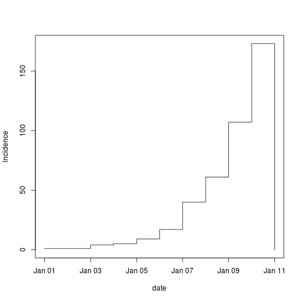
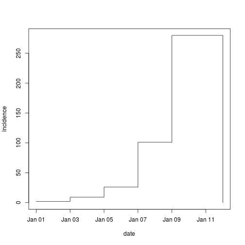

# incidence: a R package for incidence computation and visualization

#### Computing incidence using *OutbreakTools*

Here is a simple example of incidence computation using *OutbreakTools*.

Load the package and data, and extract dates:

```r
library(OutbreakTools)
data(ToyOutbreak)

dates <- get.data(ToyOutbreak, "DateInfected")

class(dates)
```

```
## [1] "Date"
```

```r
head(dates, 15)
```

```
##  [1] "2000-01-01" "2000-01-02" "2000-01-03" "2000-01-03" "2000-01-03"
##  [6] "2000-01-03" "2000-01-04" "2000-01-04" "2000-01-04" "2000-01-04"
## [11] "2000-01-04" "2000-01-05" "2000-01-05" "2000-01-05" "2000-01-05"
```

```r
range(dates)
```

```
## [1] "2000-01-01" "2000-01-10"
```

Then we compute daily incidence:

```r
incid.day <- get.incidence(dates)
incid.day
```

```
##          date incidence
## 1  2000-01-01         1
## 2  2000-01-02         1
## 3  2000-01-03         4
## 4  2000-01-04         5
## 5  2000-01-05         9
## 6  2000-01-06        17
## 7  2000-01-07        40
## 8  2000-01-08        61
## 9  2000-01-09       107
## 10 2000-01-10       173
## 11 2000-01-11         0
```

```r
plot(incid.day, type="s", main="Daily incidence")
```

 

Same, with time windows of 2 days:

```r
incid.2days <- get.incidence(dates, interval=2)
incid.2days
```

```
##         date incidence
## 1 2000-01-01         2
## 2 2000-01-03         9
## 3 2000-01-05        26
## 4 2000-01-07       101
## 5 2000-01-09       280
## 6 2000-01-12         0
```

```r
plot(incid.2days, type="s", main="2 days incidence")
```

 


#### Core code example
Core computations can be found in OutbreakTools:

https://github.com/thibautjombart/OutbreakTools/blob/master/R/get.incidence.R#l10:l58


#### Note on cutting dates
By convention, when computing incidence the left bound (ealier date) is included and the right (later date) bound excluded.
