[](https://travis-ci.org/reconhub/incidence)

[](https://codecov.io/github/reconhub/incidence?branch=master)


This package implements functions and classes to compute, handle, visualise and model incidences
from dates data.


# Installing the package

To install the devel version of the package, type:

```r
devtools::install_github("reconhub/incidence")
```


Note that this requires the package *devtools* installed.


# What does it do?

The main functions of the package include:

- **`incidence`**: compute incidence from dates in various formats; any fixed time interval can be used; the returned object is an instance of the (S3) class *incidence*.
- **`plot`**: this method (see `?plot.incidence` for details) plots *incidence* objects, and can also add predictions of the model(s) contained in an  *incidence.fit* object (or a list of such objects).
- **`fit`**: fit one or two exponential models (i.e. linear regression on log-incidence) to an *incidence* object; two models are calibrated only if a date is provided to split the time series in two (argument `split`); this is typically useful to model the two phases of exponential growth, and decrease of an outbreak; each model returned is an instance of the (S3) class *incidence.fit*, each of which contains various useful information (e.g. growth rate *r*, doubling/halving time, predictions and confidence intervals).
- **`fit.optim.split`**: finds the optimal date to split the time series in two, typically around the peak of the epidemic.
- **`[`**: lower-level subsetan of *incidence* objects, permiting to specify which dates and groups to retain; uses a syntax similar to matrices, i.e. `x[i, j]`, where `x` is the *incidence* object, `i` a subset of dates, and `j` a subset of groups.
- **`subset`**: subset an *incidence* object by specifying a time window.
- **`pool`**: pool incidence from different groups into one global incidence time series.


# Worked example: simulated Ebola outbreak

## Loading the data

This example uses the simulated Ebola Virus Disease (EVD) outbreak from the package
[*outbreaks*](http://github.com/reconhub/outbreaks). We will compute incidence for various time
steps, calibrate two exponential models around the peak of the epidemic, and analyse the results.

First, we load the data:

```r
library(outbreaks)
library(ggplot2)
library(incidence)

dat <- ebola.sim$linelist$date.of.onset
class(dat)
```

```
## [1] "Date"
```

```r
head(dat)
```

```
## [1] "2014-04-07" "2014-04-15" "2014-04-21" "2014-04-27" "2014-04-26"
## [6] "2014-04-25"
```


## Computing and plotting incidence
We compute the daily incidence:

```r
i <- incidence(dat)
i
```

```
## <incidence object>
## [5888 cases from days 2014-04-07 to 2015-04-30]
## 
## $counts: matrix with 389 rows and 1 columns
## $n: 5888 cases in total
## $dates: 389 dates marking the left-side of bins
## $interval: 1 day
## $timespan: 389 days
```

```r
plot(i)
```


The daily incidence is quite noisy, but we can easily compute other incidence using larger time intervals:

```r
## weekly
i.7 <- incidence(dat, interval=7)
plot(i.7)
```

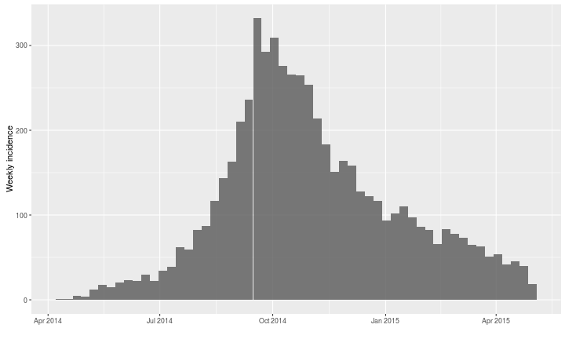

```r
## bi-weekly
i.14 <- incidence(dat, interval=14)
plot(i.14, border = "white")
```

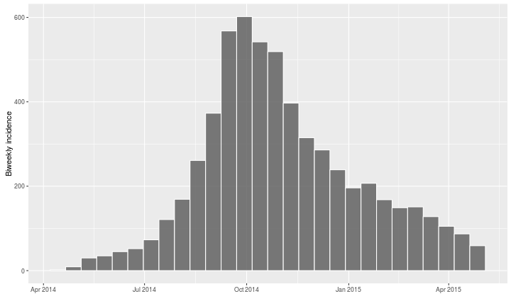

```r
## period of 30 days
i.30 <- incidence(dat, interval=30)
plot(i.30, border = "white")
```

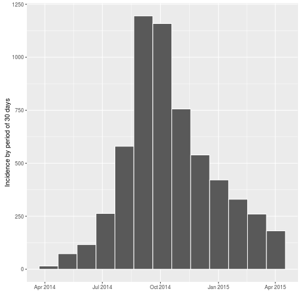

`incidence` can also compute incidence by specified groups using the `groups` argument. For instance, we can compute incidence by gender:

```r
i.7.sex <- incidence(dat, interval=7, groups = ebola.sim$linelist$gender)
i.7.sex
```

```
## <incidence object>
## [5888 cases from days 2014-04-07 to 2015-04-27]
## [2 groups: f, m]
## 
## $counts: matrix with 56 rows and 2 columns
## $n: 5888 cases in total
## $dates: 56 dates marking the left-side of bins
## $interval: 7 days
## $timespan: 389 days
```

```r
plot(i.7.sex, stack = TRUE, border = "grey")
```

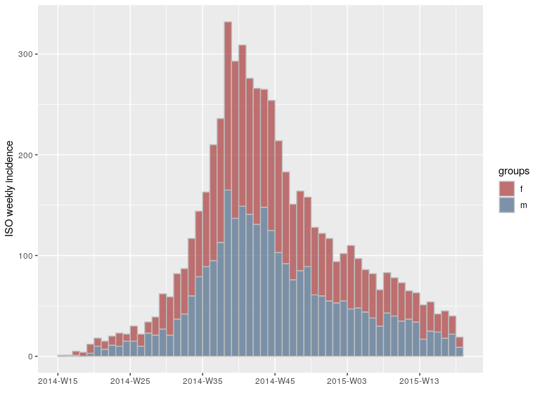

We can do the same for hospitals, using the 'clean' version of the dataset, with some customization of the legend:

```r
i.7.hosp <- with(ebola.sim.clean$linelist, 
	 incidence(date.of.onset, interval=7, groups = hospital))
i.7.hosp
```

```
## <incidence object>
## [5829 cases from days 2014-04-07 to 2015-04-27]
## [6 groups: Connaught Hospital, Military Hospital, NA, other, Princess Christian Maternity Hospital (PCMH), Rokupa Hospital]
## 
## $counts: matrix with 56 rows and 6 columns
## $n: 5829 cases in total
## $dates: 56 dates marking the left-side of bins
## $interval: 7 days
## $timespan: 389 days
```

```r
head(i.7.hosp$counts)
```

```
##      Connaught Hospital Military Hospital NA other
## [1,]                  0                 1  0     0
## [2,]                  1                 0  0     0
## [3,]                  0                 0  2     3
## [4,]                  1                 0  1     0
## [5,]                  3                 5  1     1
## [6,]                  2                 4  4     5
##      Princess Christian Maternity Hospital (PCMH) Rokupa Hospital
## [1,]                                            0               0
## [2,]                                            0               0
## [3,]                                            0               0
## [4,]                                            1               1
## [5,]                                            1               1
## [6,]                                            1               1
```

```r
plot(i.7.hosp, stack=TRUE) + 
    theme(legend.position= "top") + 
    labs(fill="")
```

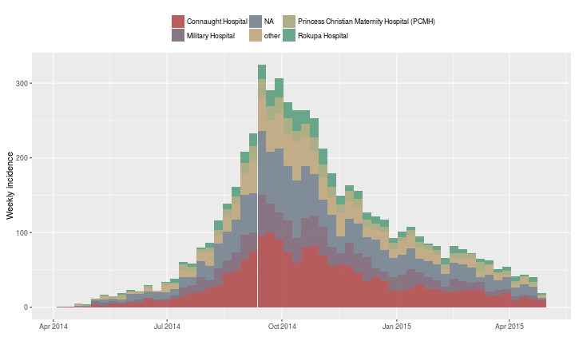


## Handling `incidence` objects
`incidence` objects can be manipulated easily. The `[` operator implements subetting of dates (first argument) and groups (second argument). 
For instance, to keep only the peak of the distribution:

```r
i[100:250]
```

```
## <incidence object>
## [4103 cases from days 2014-07-15 to 2014-12-12]
## 
## $counts: matrix with 151 rows and 1 columns
## $n: 4103 cases in total
## $dates: 151 dates marking the left-side of bins
## $interval: 1 day
## $timespan: 151 days
```

```r
plot(i[100:250])
```

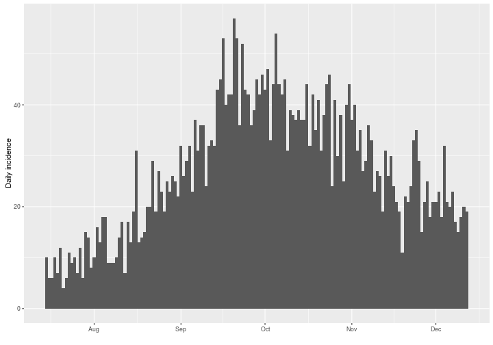

Or to keep every other week:

```r
i.7[c(TRUE,FALSE)]
```

```
## <incidence object>
## [2891 cases from days 2014-04-07 to 2015-04-20]
## 
## $counts: matrix with 28 rows and 1 columns
## $n: 2891 cases in total
## $dates: 28 dates marking the left-side of bins
## $interval: 7 days
## $timespan: 379 days
```

```r
plot(i.7[c(TRUE,FALSE)])
```

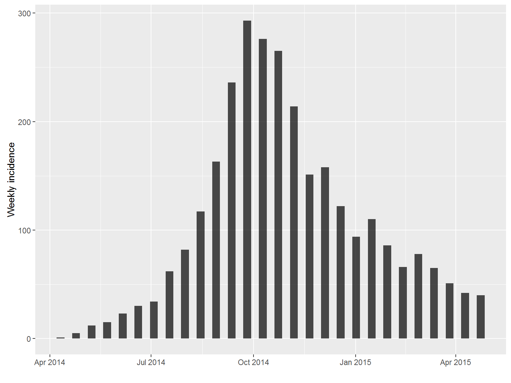

Some temporal subsetting can be even simpler using `subset`, which permits to retain data within a specified time window:

```r
i.tail <- subset(i, from=as.Date("2015-01-01"))
i.tail
```

```
## <incidence object>
## [1205 cases from days 2015-01-01 to 2015-04-30]
## 
## $counts: matrix with 120 rows and 1 columns
## $n: 1205 cases in total
## $dates: 120 dates marking the left-side of bins
## $interval: 1 day
## $timespan: 120 days
```

```r
plot(i.tail, border="white")
```

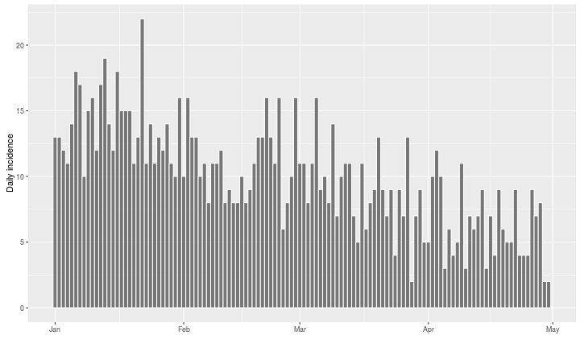

Subsetting groups can also matter. For instance, let's try and visualise the incidence based on onset of symptoms by outcome:

```r
i.7.outcome <- incidence(dat, 7, groups=ebola.sim$linelist$outcome)
i.7.outcome
```

```
## <incidence object>
## [5888 cases from days 2014-04-07 to 2015-04-27]
## [3 groups: Death, NA, Recover]
## 
## $counts: matrix with 56 rows and 3 columns
## $n: 5888 cases in total
## $dates: 56 dates marking the left-side of bins
## $interval: 7 days
## $timespan: 389 days
```

```r
plot(i.7.outcome, stack = TRUE, border = "grey")
```

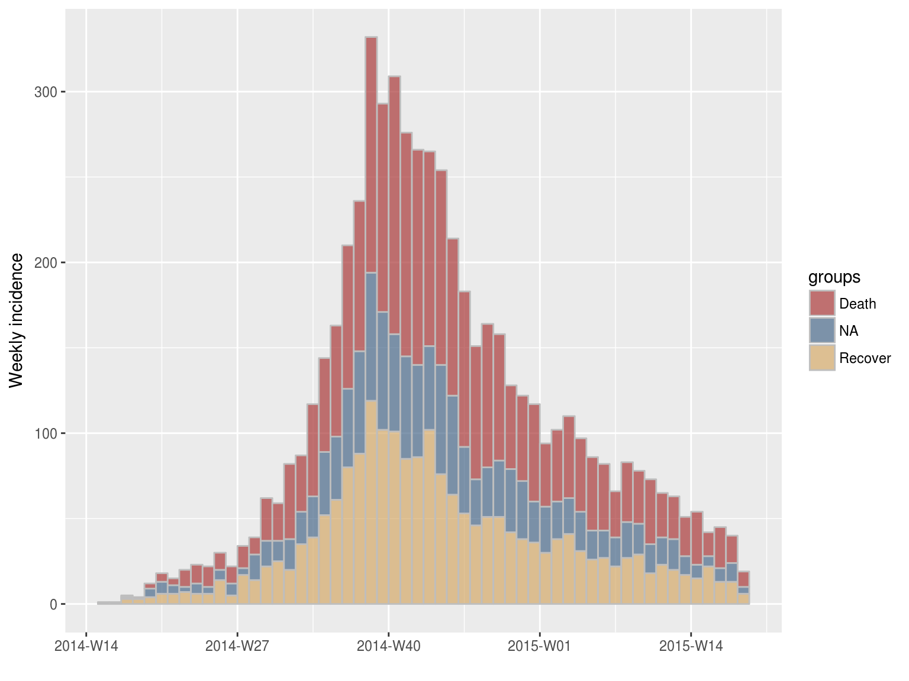

By default, `incidence` treats missing data (NA) as a separate group (see argument `na.as.group`). We could disable this to retain only known outcomes, but alternatively we can simply subset the object to exclude the last (3rd) group:

```r
i.7.outcome[,1:2]
```

```
## <incidence object>
## [3905 cases from days 2014-04-07 to 2015-04-27]
## [2 groups: Death, NA]
## 
## $counts: matrix with 56 rows and 2 columns
## $n: 3905 cases in total
## $dates: 56 dates marking the left-side of bins
## $interval: 7 days
## $timespan: 386 days
```

```r
plot(i.7.outcome[,1:2], stack = TRUE, border = "grey")
```

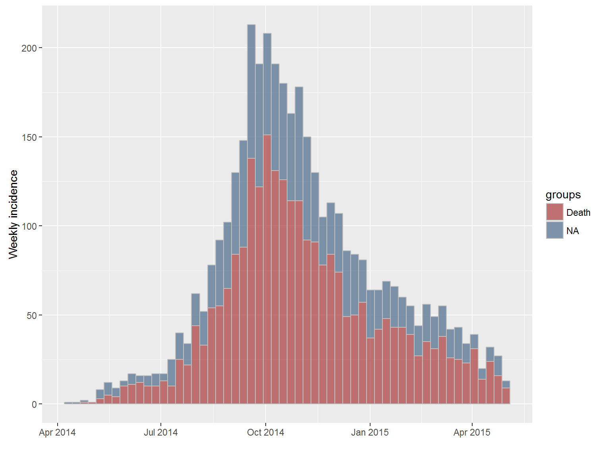

Groups can also be collapsed into a single time series using `pool`:

```r
i.pooled <- pool(i.7.outcome)
i.pooled
```

```
## <incidence object>
## [5888 cases from days 2014-04-07 to 2015-04-27]
## 
## $counts: matrix with 56 rows and 1 columns
## $n: 5888 cases in total
## $dates: 56 dates marking the left-side of bins
## $interval: 7 days
## $timespan: 389 days
```

```r
identical(i.7$counts, i.pooled$counts)
```

```
## [1] TRUE
```


## Modelling incidence

Incidence data, excluding zeros, can be modelled using log-linear regression of the form:
log(*y*) = *r* x *t* + *b*

where *y* is the incidence, *r* is the growth rate, *t* is the number of days since a specific point in time (typically the start of the outbreak), and *b* is the intercept.

Such model can be fitted to any incidence object using `fit`.
Of course, a single log-linear model is not sufficient for modelling our time series, as there is clearly an growing and a decreasing phase.
As a start, we can calibrate a model on the first 20 weeks of the epidemic:


```r
plot(i.7[1:20])
```

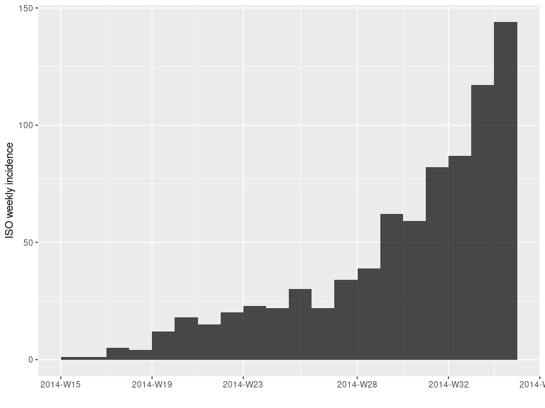

```r
early.fit <- fit(i.7[1:20])
early.fit
```

```
## <incidence.fit object>
## 
## $lm: regression of log-incidence over time
## 
## $info: list containing the following items:
##   $r (daily growth rate):
## [1] 0.03175771
## 
##   $r.conf (confidence interval):
##           2.5 %     97.5 %
## [1,] 0.02596229 0.03755314
## 
##   $doubling (doubling time in days):
## [1] 21.8261
## 
##   $doubling.conf (confidence interval):
##         2.5 %   97.5 %
## [1,] 18.45777 26.69823
## 
##   $pred: data.frame of incidence predictions (20 rows, 5 columns)
```

The resulting objects can be plotted, in which case the prediction and its confidence interval is displayed:


```r
plot(early.fit)
```


However, a better way to display these predictions is adding them to the incidence plot using the argument `fit`:

```r
plot(i.7[1:20], fit = early.fit)
```

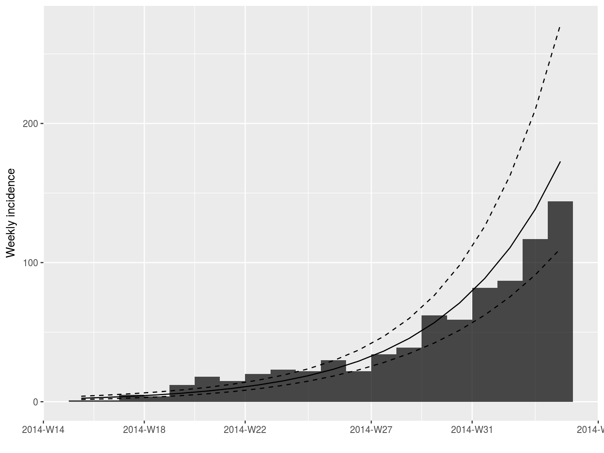


In this case, we would ideally like to fit two models, before and after the peak of the epidemic.
This is possible using the following approach, if you know what date to use to split the data in two phases:

```r
fit.both <- fit(i.7, split=as.Date("2014-10-15"))
fit.both
```

```
## $before
## <incidence.fit object>
## 
## $lm: regression of log-incidence over time
## 
## $info: list containing the following items:
##   $r (daily growth rate):
## [1] 0.02741985
## 
##   $r.conf (confidence interval):
##           2.5 %     97.5 %
## [1,] 0.02407933 0.03076038
## 
##   $doubling (doubling time in days):
## [1] 25.27902
## 
##   $doubling.conf (confidence interval):
##         2.5 %   97.5 %
## [1,] 22.53377 28.78598
## 
##   $pred: data.frame of incidence predictions (28 rows, 5 columns)
## 
## $after
## <incidence.fit object>
## 
## $lm: regression of log-incidence over time
## 
## $info: list containing the following items:
##   $r (daily growth rate):
## [1] -0.01014465
## 
##   $r.conf (confidence interval):
##            2.5 %       97.5 %
## [1,] -0.01127733 -0.009011981
## 
##   $halving (halving time in days):
## [1] 68.32636
## 
##   $halving.conf (confidence interval):
##         2.5 %   97.5 %
## [1,] 61.46379 76.91397
## 
##   $pred: data.frame of incidence predictions (28 rows, 5 columns)
```

```r
plot(i.7, fit=fit.both)
```

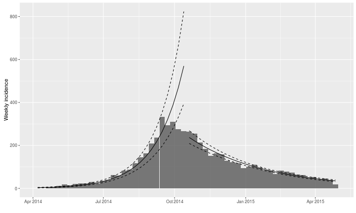

This is much better, but the splitting date is not completely optimal. To look for the best possible splitting date (i.e. the one maximizing the average fit of both models), we use:

```r
best.fit <- fit.optim.split(i.7)
best.fit
```

```
## $df
##         dates   mean.R2
## 1  2014-08-04 0.7650406
## 2  2014-08-11 0.8203351
## 3  2014-08-18 0.8598316
## 4  2014-08-25 0.8882682
## 5  2014-09-01 0.9120857
## 6  2014-09-08 0.9246023
## 7  2014-09-15 0.9338797
## 8  2014-09-22 0.9339813
## 9  2014-09-29 0.9333246
## 10 2014-10-06 0.9291131
## 11 2014-10-13 0.9232523
## 12 2014-10-20 0.9160439
## 13 2014-10-27 0.9071665
## 
## $split
## [1] "2014-09-22"
## 
## $fit
## $fit$before
## <incidence.fit object>
## 
## $lm: regression of log-incidence over time
## 
## $info: list containing the following items:
##   $r (daily growth rate):
## [1] 0.02982209
## 
##   $r.conf (confidence interval):
##           2.5 %     97.5 %
## [1,] 0.02608945 0.03355474
## 
##   $doubling (doubling time in days):
## [1] 23.24274
## 
##   $doubling.conf (confidence interval):
##         2.5 %  97.5 %
## [1,] 20.65721 26.5681
## 
##   $pred: data.frame of incidence predictions (25 rows, 5 columns)
## 
## $fit$after
## <incidence.fit object>
## 
## $lm: regression of log-incidence over time
## 
## $info: list containing the following items:
##   $r (daily growth rate):
## [1] -0.01016191
## 
##   $r.conf (confidence interval):
##            2.5 %       97.5 %
## [1,] -0.01102526 -0.009298561
## 
##   $halving (halving time in days):
## [1] 68.21031
## 
##   $halving.conf (confidence interval):
##         2.5 %   97.5 %
## [1,] 62.86899 74.54349
## 
##   $pred: data.frame of incidence predictions (32 rows, 5 columns)
## 
## 
## $plot
```

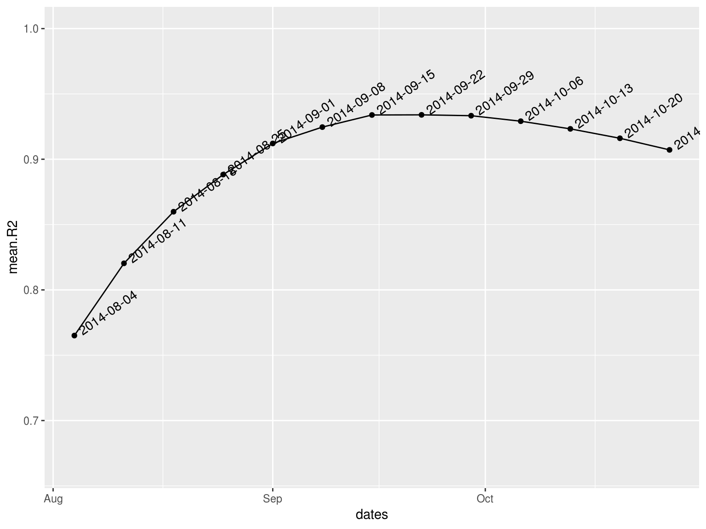

```r
plot(i.7, fit=best.fit$fit)
```

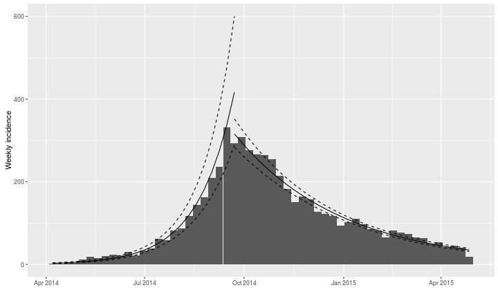

These models are very good approximation of these data, showing a doubling time of 23.2 days during the first phase, and a halving time of 68.2 days during the second.


Note that `fit` will also take groups into account if incidence has been computed for several groups:

```r
best.fit2 <- fit.optim.split(i.7.sex)$fit
best.fit2
```

```
## $before
## <incidence.fit object>
## 
## $lm: regression of log-incidence over time
## 
## $info: list containing the following items:
##   $r (daily growth rate):
##          f          m 
## 0.02381854 0.02640719 
## 
##   $r.conf (confidence interval):
##        2.5 %     97.5 %
## f 0.02097832 0.02665876
## m 0.01955031 0.03326408
## 
##   $doubling (doubling time in days):
##        f        m 
## 29.10116 26.24842 
## 
##   $doubling.conf (confidence interval):
##      2.5 %   97.5 %
## f 26.00073 33.04111
## m 20.83771 35.45454
## 
##   $pred: data.frame of incidence predictions (46 rows, 6 columns)
## 
## $after
## <incidence.fit object>
## 
## $lm: regression of log-incidence over time
## 
## $info: list containing the following items:
##   $r (daily growth rate):
##           f           m 
## -0.01002305 -0.01056026 
## 
##   $r.conf (confidence interval):
##         2.5 %       97.5 %
## f -0.01110163 -0.008944473
## m -0.01316417 -0.007956340
## 
##   $halving (halving time in days):
##        f        m 
## 69.15531 65.63734 
## 
##   $halving.conf (confidence interval):
##      2.5 %   97.5 %
## f 62.43653 77.49447
## m 52.65406 87.11885
## 
##   $pred: data.frame of incidence predictions (62 rows, 6 columns)
```

```r
plot(i.7.sex, fit=best.fit2)
```

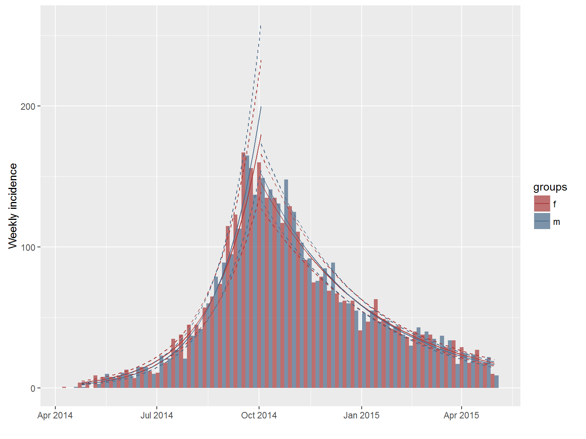


### Contributors (by alphabetic order):
- Thibaut Jombart (@thibautjombart)
- Rich Fitzjohn (@richfitz)

Maintainer: Thibaut Jombart (thibautjombart@gmail.com)
